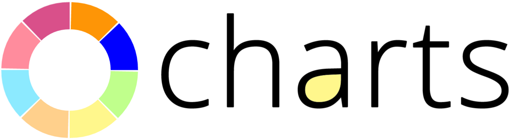

# Demo Swift Charts



This demonstration shows:

  * The [Swift](http://swift.org) programming language with
    [Apple](http://apple.com)
    [Xcode](https://developer.apple.com/xcode/)
    [iOS](http://www.apple.com/ios/)

  * The [Charts](https://github.com/danielgindi/Charts) library

This README describes how to create the demo.

This work is thanks to the excellent [Appcode iOS charts API tutorial](http://www.appcoda.com/ios-charts-api-tutorial/)

To learn more about iOS Charts and MPAndriod Charts, see the official sites:

  * [iOS Charts](https://github.com/danielgindi/ios-charts) by [Daniel Gindi](https://github.com/danielgindi) 
  * [MPAndroidChart](https://github.com/PhilJay/MPAndroidChart) by [Phil Jahoda](https://github.com/PhilJay)

If you like iOS Charts and MPAndroid Charts, please consider making a donation to the authors. 


## Start

To use this demo, you can clone this repo, or you can use this README to create your own project.

If you clone this repo, then be aware that there are multiple git branches, so pick the one you want.

  * swift-4-xcode-9: Swift version 4, Xcode version 9, iOS version 11.

  * swift-3-xcode-8: Swift version 3, Xcode version 8, iOS version 10.


## Create the project

Launch Xcode and create a new Xcode project. 

  * Use iOS template "Single View Application" and Product Name "Demo Swift Charts".

  * [Help](doc/setup/create_a_new_xcode_project.md)
	
Add Charts to the project. We suggest using Carthage, or Cocoapods, or Swift Package Manager. 

  * Carthage `Cartfile` for Swift 3 and Xcode 8:

    ```
    github "danielgindi/Charts" "v3.0.3"
    ```

  * Carthage `Cartfile` for Swift 4 and Xcode 9:

    ```
    github "danielgindi/Charts" "v3.0.4"
    ```

  * Carthage command:

    ```shell
    carthage build --no-skip-current && carthage archive Charts.
    ```

  * [Help](doc/setup/add_carthage_frameworks.md)


## Create a view

Open the view:

  * For example, edit `Main.storyboard` → `View Controller Scene` → `View Controller` → `View`.

  * In the right lower list of UI items, drag-and-drop a "View" item onto the storyboard.

  * Add contraints to make the the "View" item as big as you want.

Set the class:

  * Select the View. 

  * Go to the Identity Inspector.

  * Edit the "Custom Class" area.

      * Class: BarChartView

      * Module: Charts
    
Create an outlet:

  * For example, edit `Main.storyboard` → `View Controller Scene` → `View Controller` → `View`.

  * Open the Assistant Editor and edit `ViewController.swift`. 

  * Control-drag the view to the class. This creates the outlet. Name the outlet `demoBarChartView`. 

  * At the top of the class, add `import Charts`

Edit the code to be like this:

```swift
import UIKit
import Charts
	
class ViewController: UIViewController {
	
  @IBOutlet weak var demoBarChartView: BarChartView!
	
  override func viewDidLoad() {
    super.viewDidLoad()
    demoBarChartView.noDataText = "This is the chart ready for data."
  }
	
  override func didReceiveMemoryWarning() {
    super.didReceiveMemoryWarning()
  }
	
}
```
 
## Run

Run the project.

The Simulator screen shows the text "This is the chart ready for data."
 
If you don't see the text, then look in Xcode for any error messages, and also verify that you set the custom class correctly.

Congratulations, you're successful!


## Tracking

* Package: demo_swift_charts
* Version: 3.0.0
* Created: 2016-04-09
* Updated: 2017-09-22
* License: BSD, GPL, MIT
* Contact: Joel Parker Henderson (http://joelparkerhenderson.com)
